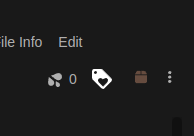

# Stash Tag

Stash tag is userscript to uses the playbar sprite images to do image recognition and return a list of possible tags to apply to the video.

This is a userscript used with [Stash](https://github.com/stashapp/stash)

# Stash Userscripts

Installation requires a browser extension such as [Violentmonkey](https://violentmonkey.github.io/) / [Tampermonkey](https://www.tampermonkey.net/) / [Greasemonkey](https://www.greasespot.net/).

**By default the userscripts only work for `http://localhost:9999`**

> If you access Stash from a different address, you will need to modify the userscript when you install it.
>
> Find the line `// @match       http://localhost:9999/*` and replace `http://localhost:9999/*` with your Stash address.

[INSTALL USERSCRIPT](stashtag.user.js?raw=1)

Once installed, A new icon will show on a scene's page next to the organized button.

